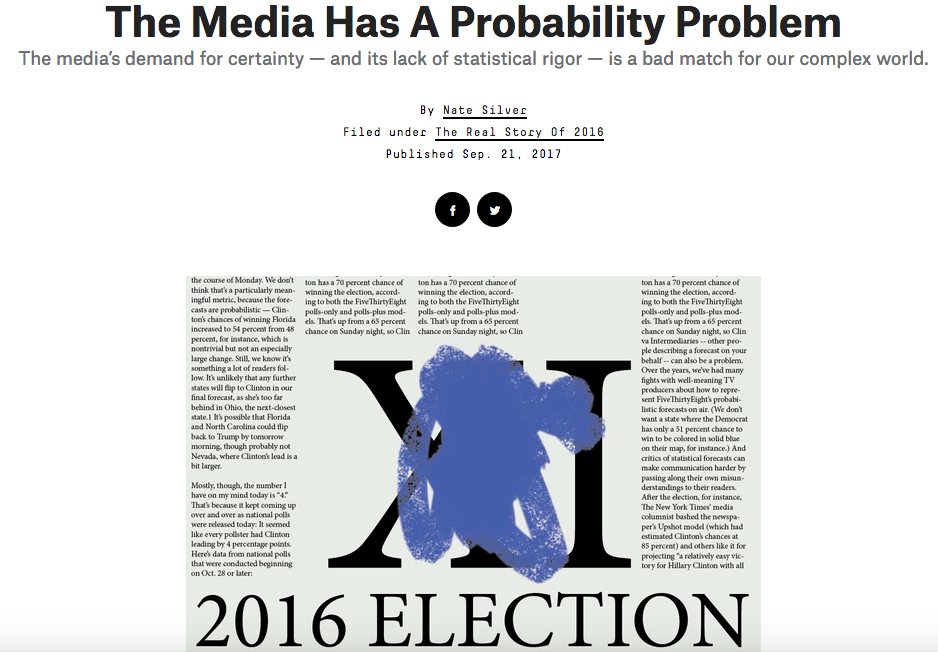
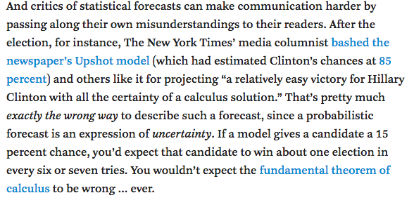
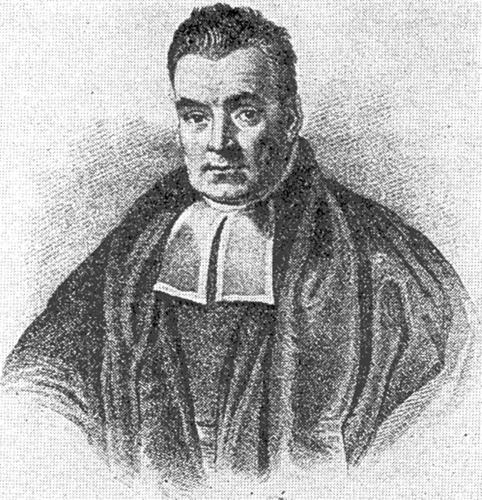
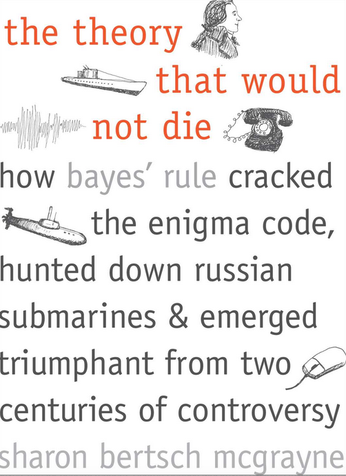
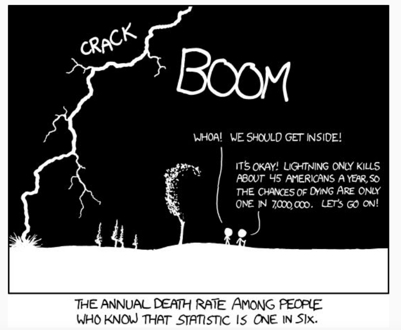
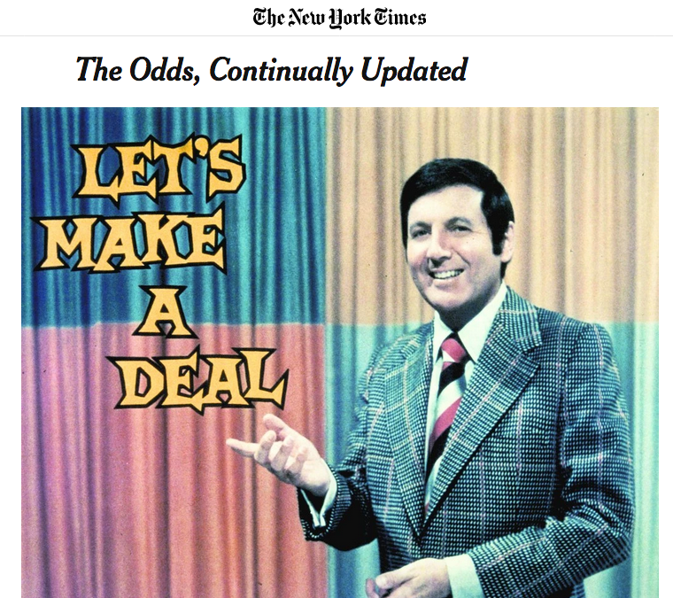
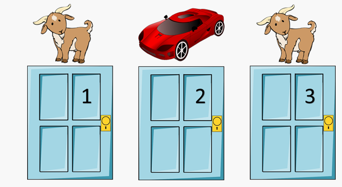

```{r setup, include=FALSE}
options(htmltools.dir.version = FALSE)
r <- getOption("repos")
r["CRAN"] <- "http://cran.cnr.berkeley.edu/"
options(repos = r)
set.seed(12345)
```


<style>

.remark-slide-number {
  position: inherit;
}

.remark-slide-number .progress-bar-container {
  position: absolute;
  bottom: 0;
  height: 6px;
  display: block;
  left: 0;
  right: 0;
}

.remark-slide-number .progress-bar {
  height: 100%;
  background-color: #EB811B;
}

.orange {
  color: #EB811B;
}
</style>

# Chapter 6 - Probability

.font150[
* Probability axioms

* Conditional probability

* Bayes' theorem

* Law of large numbers

* Probability distributions
]
---

# Today's Agenda

.font150[
* Frequentist and Bayesian probability frameworks

* The three probability axioms

* Permutations

* Combinations
]
---

# Why Probability?

.font150[
* .orange[Probability rules our lives]
]
--
.font150[
* It is everywhere
]
--
.font150[
* However, humans are _really bad_ at interpreting probabilities

* Even worse at calculating (estimating) probabilities
]
---

# Why Probability?

.center[]
---

# Why Probability?

.center[]

.font150[
More at <https://fivethirtyeight.com/features/the-media-has-a-probability-problem/>
]
---

# Why Probability?

.font150[
* What are the chances it rains tomorrow?

* What are the chances you win the lottery?

* What is the probabilty of getting an 10 in my class?
]
---

# What Is Probability

.font150[
* A mathematical model of uncertainty (chance)

* Preview: later we will use probability to make statements about uncertainty in data analysis (chapter 7)
]
---

# Two Concepts of Probability

.font150[
* .orange[Frequentist]: long-run frequency of events
  - Ratio between the number of times the event occurs and the number of trials
  - Example: coin flips
]
--
.font150[
* .orange[Bayesian]: subjective belief about the likelihood of event occurrence
  - Evidence based belief
  - Often more sensible philosophy in political world
]
---

# Thomas Bayes

.center[]

.font150[
<https://en.wikipedia.org/wiki/Thomas_Bayes>
]
---

# The Theory That Would Not Die

.center[]
---

# Egon Pearson

.center[]

.font150[
<https://en.wikipedia.org/wiki/Egon_Pearson>
]
---

# Ronald Fisher

.center[]
.font150[
<https://en.wikipedia.org/wiki/Ronald_Fisher>
]

---

# Important Terms

.font150[
* .orange[Experiment]: an action or a set of actions that producestochastic events of interest
  - coin toss, rolling a die, voting in an election
  
* .orange[Sample Space] $(\Omega)$: all possible outcomes of the experiment
  - {heads, tails}, {1,2,3,4,5,6}, {abstain, Clinton, Trump}
  
* .orange[Event]: subset of sample space
  - tails, 1, vote for Trump
]
---

# Example

.font150[
What is the experiment, sample space, and one event for coin flips or pulling a single card out of a deck of 52? 
]
---

# Example

.font140[
Probability of event A $= P(A) = \frac{\text{number of elements in A}}{\text{number of elements in sample space}}$

Probability of heads $= P(H) = \frac{heads}{heads + tails} = \frac{1}{2}$
]
--
.font140[
What is the probability of 3 heads in 3 flips?

Sample space?]
--
.font140[
$$\Omega = \{HHH,HHT,HTH,THH, HTT, THT, TTH, TTT\}$$
What is the event space we are interested in?]
--
.font150[
$$\{HHH\}$$
]
---

# Example

.font140[
What is the probability of 3 heads in 3 flips?

$$P(3 H) = \frac{\{HHH\}}{\{HHH,HHT,HTH,THH, HTT, THT, TTH, TTT\}}$$
$$P(3 H) = \frac{1}{8}$$
]
---

# Another Example

.font140[
What is the probability of at least 2 heads in 3 flips?

Sample space?]
--
.font140[
$$\Omega = \{HHH,HHT,HTH,THH, HTT, THT, TTH, TTT\}$$
What is the event space we are interested in?]
--
.font140[
$$\{HHH, HTH, THH, HHT\}$$]
--
.font140[
$$P(2 H) = \frac{4}{8}$$ 
]
---

# Axioms (Rules) of Probability

.font140[
From 3 axioms, the entire probability theory can be built
]
.font140[
* Probability of any event is non-negative:
 $$P(A) \ge 0$$
 
* Prob. that one of the outcomes in the sample space occurs is 1
$$P(\Omega) = 1$$

* .orange[Addition Rule:] If events A and B are mutually exclusive (_meaning only one can happen at a time_), then
$$P(A\ \textsf{or}\ B) \ = \ P(A) + P(B)$$
]
---

# Useful Rules of Probability

.font150[
* $A^c$ - complement to A, i.e. part of sample space not in A

* Sometimes it is easier to calculate the probability of an event by using its complement
]
---

# Useful Rules of Probability

.font150[
What is the probability of having at least one tails in 3 coin flips?]
--
.font150[
$$\Omega = \{HHH,HHT,HTH,THH, HTT, THT, TTH, TTT\}$$]
--
.font150[
P(at least one T) = $\frac{7}{8}$

P(at least one T) = $1 - P(HHH) = 1 - \frac{1}{8}$
]
---

# Example

.font150[
What is the probability of getting a Queen as the first card from a full deck?

$$\Omega = ?$$]
--
.font150[
$$P(Queen) = \frac{4}{52} = \frac{1}{13}$$
]
---

# Permutation: When Order Matters

.font150[
* Often we do not want to or can't write out all possible combinations by hand

* How many possibilities are there to arrange letters A,B,C?]
--
.font150[
* Three outcomes: A, B, C and three draws]
--
.font150[
* First draw: A, B, or C

* Second draw: two possibilities

* Third draw: one left

* 3 x 2 x 1 possibilities 
]
---

# Permutation

.font150[
* Permutations count many ways we can .orange[order] _k_ objects out of a set of _n_ unique objects

$$_{n}P_{k} = n \times (n-1) \times (n-2) \times ... \times (n-k + 1) = \frac{n!}{(n-k)!}$$

* What does _n!_ stand for?]
--
.font150[
* n! = n-factorial = $n \times (n-1) \times (n-2) \times ... \times (n-n+1)$

* $3! = 3 \times 2 \times 1$

* .orange[Note:] $0! = 1$
]
---

# Permutation Example

.font150[
* How many ways can we arrange four cards out of the 13 spades in our card deck?
]
--
.font150[
* first draw = ?
]
--
.font150[
* $13 \times 12 \times 11 \times 10$]
--
.font150[
* $\frac{13!}{(13-4)!} = \frac{13!}{9!} = \frac{13 \times 12 \times 11 \times ... \times 2 \times 1}{9 \times 8 \times ... \times 2 \times 1} =$

* $13 \times 12 \times 11 \times 10 = 17,160$
]
---

# Combinations

.font140[
* Combinations are similar to permutations, except that the ordering doesn't matter

* So with respect to combinations of 3 out of 26 letters, ABC, BAC, CAB, etc are the same 

* There are .orange[always] fewer combinations than permutations

* Draw 2 out of letters ABC. Permutations:
]
--
.font140[
* AB, AC, BA, BC, CA, CB =  $\frac{3!}{1!}$

* Combinations:]
--
.font140[
* AB, AC, BC
]
---

# How to Calculate Combinations

.font150[
* Calculate permutations and then account for the fact that we overcounted due to ordering

* Get rid of counts of different arrangements of same combination: divide by $k!$

* $_{n}C_{k} = {n \choose k} = \frac{_{n}P_{k}}{k!} = \frac{n!}{k!(n-k)!}$]
--
.font150[
* Why divide by $k!$ ?]
--
.font150[
* for two sampled elements, we have $2!(= 2×1 = 2): A, B = AB, BA$
]
---

# Combination Example: Winning the Lottery

.font150[
* What is the probability of winning (simplified) Mega Millions?

* Pick five numbers between 1 and 70

* Probability of getting 5 correct?

* Size of the sample space?
]
--
.font120[
$${70 \choose 5} = \frac{70!}{5! \times (70-5)!} =  \frac{70!}{5! \times 65!}$$
]
--
.font120[$$12,103,014$$]
---

# How To Solve in R

.font150[
* Just use the `choose()` function:

```{r r01,fig.align="center",tidy=F,warning=F,message=F,cache=T}
choose(70, 5) # from 70 numbers, choose 5
```
]
---

class: inverse, center, middle

# Questions?

<html><div style='float:left'></div><hr color='#EB811B' size=1px width=720px></html>  
---

# Conditional Probability

.center[]
---

# Conditional Probability

.font130[
* Sometimes information about one event can help inform us aboutlikelihood of another event

* Examples?
]
--
.font130[
* What is the probability of rolling a 5 and then a 6?

* What is the probability of rolling a 5 and then a 6 given that we rolled a 5 first?

* If it is cloudy outside, gives us additional information about likelihood of rain

* If we know that one party will win the House, makes it more likely that party will win certain Senate races
]
---

# Independence

.font150[
* If the occurrence of one event (A) gives us information about the likelihood of another event, then the two events are .orange[not independent]

* .orange[Independence] of two events implies that information about one event does not help us in knowing whether the second event will occur

* For many real world examples, independence does not hold

* Knowledge about other events allows us to improve guesses/probability calculations
]
---

# Independence

.font150[
* When two events are independent, the probability of both happening is equal to the individual probabilities multiplied together

* And what is the probability of one event when it is conditional to each another?
]
---

# Conditional Probability

.font150[
* $P(A | B)$

* _Probability of A given/conditional that B has happened_
]
--
.font150[
* $P(A | B) = \frac{P(A and B)}{P(B)}$

* _Probability of A and B happening (joint) divided by probability of B happening (marginal)_
]
--
.font150[
* Definitions:

  - $P(A and B)$ - joint probability

  - $P(A)$ - marginal probability
]
---

# Conditional Probability

.font150[
* P(rolled 5 then 6) = ?
]
--
.font150[
* P(rolled 5 then 6) = $\frac{1}{36}$

* P(rolled 5 then 6 | 5 first) =  $\frac{P(5 then 6)}{P(5)}$
]
--
.font150[
* $\frac{\frac{1}{36}}{\frac{1}{6}} = \frac{1}{6}$
]
---

# Conditional Probability

.font150[
* The probability that it is Friday and that a student is absent is 0.03. What is the probability that student is absent, given that it is Friday?

* $P(absent | Friday) = ?$
]
--
.font150[
* $P(absent | Friday) = \frac{0.03}{0.2} = 0.15$
]
---

# Conditional Probability

.font150[
* $P(A | B) = \frac{P(A and B)}{P(B)}$

* Also means:

* $P(A and B) = P(A | B) P(B)$

* Just multiply both sides by $P(B)$ to get rid of the denominator
]
---

# Independence

.font150[
* If A and B are independent, then
  - $P(A | B) = P(A) \&  P(B | A) = P(B)$
  
  - $P(A and B) = P(A) \times P(B)$

* If $A|C$ and $B|C$ are independent, then
  - $P(A and B | C) = P(A |C) \times P(B | C)$
]
---

class: inverse, center, middle

# You Already Know All That!

<html><div style='float:left'></div><hr color='#EB811B' size=1px width=720px></html>  
---

# You Already Know All That 

.font150[
* Let's again use our `resume` dataset
]
--
.font130[
```{r cv01,fig.align="center",tidy=F,warning=F,message=F,cache=T}
resume <- read.csv("https://raw.githubusercontent.com/umbertomig/intro-prob-stat-FGV/master/datasets/resume.csv")
names(resume)
head(resume)
```
]
---

# Resume

.font130[
* Now please tell me what the two commands below do, and what the results mean
```{r cv02,fig.align="center",tidy=F,warning=F,message=F,cache=T}
mean(resume$call)
tapply(resume$call, resume$race, mean)
```
]
--
.font130[
* First result: getting a phone call overall

* Second result: getting a phone call .orange[conditional on race]
]
---

# Subset

.font140[
* The `subset` function in `R` is nothing but a tool to get conditional probabilities

```{r cv03,fig.align="center",tidy=F,warning=F,message=F,cache=T}
black <- subset(x = resume$call,
                subset = resume$race == "black")
mean(black)
```
]
--
.font140[
* Compare:
```{r cv04,fig.align="center",tidy=F,warning=F,message=F,cache=T}
tapply(resume$call, resume$race, mean)
```
]
---

# Prop.table and joint probability

.font150[
* We can easily calculate joint probabilities with `prop.table(table())`
```{r cv05,fig.align="center",tidy=F,warning=F,message=F,cache=T}
prop.table(table(call = resume$call, resume$race))
```
]
---

# Prop.table and joint probability

.font120[
```{r cv06,fig.align="center",tidy=F,warning=F,message=F,cache=T}
prop.table(table(call = resume$sex, resume$race))
prop.table(table(resume$sex))
prop.table(table(resume$race))
```
]
---

# Another Example

.font130[
| Annual income     | Didn't Take Stats    | Took Stats    | TOTAL |
| :---------------- | :------------------- | :------------ | :---- |
| Under 50,00       | 36                   | 24            | 60    |
| 50,000 to 100,000 | 109                  | 56            | 165   |
| Over 100,000      | 35                   | 40            | 75    |
| Total             | 180                  | 120           | 300   |

* What is the probability of any student making over $100,000?
]
--
.font130[
* What is the probability of a student making over $100,000, conditional that she took Stats?
]
--
.font130[
* What is the probability of a having taken Stats, conditional on  making over $100,000?
]
---

# The Monty Hall Problem

.center[]
---

# The Monty Hall Problem!

.center[]
---

# The Monty Hall Problem

.font140[
"Many readers of vos Savant's column refused to believe switching is beneficial despite her explanation. After the problem appeared in Parade, approximately 10,000 readers, including nearly 1,000 with PhDs, wrote to the magazine, most of them claiming vos Savant was wrong (Tierney 1991). Even when given explanations, simulations, and formal mathematical proofs, many people still do not accept that switching is the best strategy (vos Savant 1991a). _Paul Erdős, one of the most prolific mathematicians in history, remained unconvinced until he was shown a computer simulation demonstrating the predicted result_ (Vazsonyi 1999)."

<https://en.wikipedia.org/wiki/Monty_Hall_problem>
]
---

# The Monty Hall Problem

.center[
<iframe width="560" height="315" src="https://www.youtube.com/embed/_X5erR9LKUs" frameborder="0" allow="accelerometer; autoplay; encrypted-media; gyroscope; picture-in-picture" allowfullscreen></iframe>
]

.font150[Probability: The Monty Hall Problem: <https://youtu.be/_X5erR9LKUs>]
---

class: inverse, center, middle

# Questions?

<html><div style='float:left'></div><hr color='#EB811B' size=1px width=720px></html>  
---

class: inverse, center, middle

# See you on Thursday!

<html><div style='float:left'></div><hr color='#EB811B' size=1px width=720px></html>  