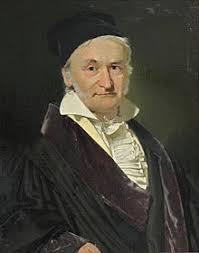

```{r setup, include=FALSE}
options(htmltools.dir.version = FALSE)
r <- getOption("repos")
r["CRAN"] <- "http://cran.cnr.berkeley.edu/"
options(repos = r)
set.seed(12345)
```

<style>

.remark-slide-number {
  position: inherit;
}

.remark-slide-number .progress-bar-container {
  position: absolute;
  bottom: 0;
  height: 6px;
  display: block;
  left: 0;
  right: 0;
}

.remark-slide-number .progress-bar {
  height: 100%;
  background-color: #EB811B;
}

.orange {
  color: #EB811B;
}
</style>

# Today's Agenda

.font150[
* Random variables

* Binomial and normal distributions

* Expectation and variance

* Law of Large Numbers

* Central Limit Theorem

]
---
class: inverse, center, middle

# To start our discussion: why we have probability distributions?

<html><div style='float:left'></div><hr color='#EB811B' size=1px width=720px></html> 
---

# Random Variables

.font130[
* What is a random variable? We assign a number to an event
    - Coin flip: tail = 0; heads = 1
    - Mayor's election: Bruno Covas = 0; Joyce Hasselman = 1
    - Voting: vote = 1; not vote = 0
    
* The values of random variables must represent _mutually exclusive and exhaustive events_
    
* Probability distribution: Probability that a random variable takes a certain value
    - P(coin = 1); P(coin = 0)
    - P(election = 1); P(election = 0)
]
---
class: inverse, center, middle

# Your turn: A fair coin is tossed two times. Consider the random variable: number of heads. What is its distribution?

<html><div style='float:left'></div><hr color='#EB811B' size=1px width=720px></html> 
---

# Random Variables and Probability Distributions

.font130[
* .orange[Probability density function (PDF):] $f(x)$ 
    - Probability that a random variable $X$ takes a particular value. 
    - Associated with continuous variables, must be integrated over an interval
    
* .orange[Probability mass function (PMF):] when $X$ is discrete, $f(x) = P(X = x)$. Only discrete random variables have PMFs

* .orange[Cumulative distribution function (CDF):] $f(x) = P(X \leq x)$
    - What is the probability that a random variable $X$ takes a value equal to or less than $x$?
    - Area under the density curve (we use $\sum$ or $\int$)
]

---
# Statistics of a Random Variable: Mean
.font130[
* A random variable has support where the density function is defined. For example: the die has support in the numbers $\{1,2,3,4,5,6\}$.

* The support for the die is: $S = \{1,2,3,4,5,6\}$.

* Mean: the mean of a random variable $x$, with distribution $f(x)$ is defined as:

$$ \mathbb{E}(x) = \sum_{x_i \in S} x_if(x_i) $$

* The mean is a measure of **centrality** in the data!
]
---
# Statistics of a Random Variable: Variance
.font130[
* Variance: the variance of a random variable $x$, with distribution $f(x)$ is defined as:

$$ \mathbb{V}(x) = \sum_{x_i \in S} (x_i-\mathbb{E}(x))^2f(x_i) $$

* Variance: measures the **dispersion** in the data. 

* The **standard deviation** is the square-root of the variance.
]
---

class: inverse, center, middle

# Your turn: consider the random variable *die face number*. What is the mean and variance of this random variable?

<html><div style='float:left'></div><hr color='#EB811B' size=1px width=720px></html> 
---

class: inverse, center, middle

# Discrete distributions

<html><div style='float:left'></div><hr color='#EB811B' size=1px width=720px></html> 
---

# Uniform distribution
.font130[
* Uniform distribution: all values in the (discrete) support have the same chance of get selected.

* Examples: 
  - Coin toss.
  - Dice.
  - Put the 26 letters in a box and select one letter.

* Definition: If the support is $\{x_1, \cdots x_k\}$, the variable has uniform distribution iff:

$$\mathbb{P}(x_i) = \dfrac{1}{k} $$
]
---

# Bernoulli trial

.font130[
* Bernoulli trial is a distribution named after the mathematician Jacob Bernoulli.

.center[]

* A trial consists in a binary event with two possible outcomes: success (1) or failure (0).

* The probability distribution is equal to:

$$ \mathbb{P}(Success) = \mathbb{P}(1) = p $$

With $p\in[0,1]$.

]

---

class: inverse, center, middle

# Your turn: what is the mean and variance of a Bernoulli trial?

<html><div style='float:left'></div><hr color='#EB811B' size=1px width=720px></html> 

---

# Binomial Distribution

.font150[
* The binomial distribution shows the number of successes in repeated Bernoulli trials.

* What is a repeated trial?

* E.g. suppose 90% of people in a given town likes the mayor. If we randomly select 100 people, what is the chance that at least 80 people out of 100 like the mayor?
  - 100 Bernoulli trials!

]

---

# Binomial Distribution

.font150[
*  .orange[PMF:] for $x \in \{0, 1, \dots, n\}$,

    $$f(x) \ = \ P(X = x) \ = \ {n \choose x} p^x (1-p)^{n-x}$$ 

* .orange[PMF] tells us what is the probability of $x$ _successes_ given $n$ trials with with $P(x) = p$

* In `R`:

```{r binom01,fig.align="center",tidy=F,warning=F,message=F,cache=T}
# prob of 2 successes in 4 trials
dbinom(2, size = 4, prob = 0.5) 
```
]
---

# Binomial Distribution

.font150[
* .orange[CDF:] for $x \in \{0, 1, \dots, n\}$
    $$f(x) \ = \ P(X \le x) \ = \ \sum_{k = 0}^x {n\choose k} p^k (1-p)^{n-k}$$

* .orange[CDF] tells us what is the probability of _x or fewer successes_ given $n$ trials with $P(x) = p$

* In `R`:

```{r binom02,fig.align="center",tidy=F,warning=F,message=F,cache=T}
# prob of 2 or fewer (= 0,1,2) successes in 4 trials
pbinom(2, size = 4, prob = 0.5)
```
]
---

# PMF and CDF

.font150[
* CDF of $F(x)$ is equal to the sum of the results from calculating the PMF for all values smaller and equal to $x$

* In `R`

```{r binom03,fig.align="center",tidy=F,warning=F,message=F,cache=T}
pbinom(2, size = 4, prob = 0.5) # CDF
sum(dbinom(c(0, 1, 2), 4, 0.5)) # summing up the PDFs
```
]
---

# Binomial Distribution

.font150[
* Example: flip a fair coin 3 times

    $$f(x) \ = \ P(X = x) \ = \ {n \choose x} p^x (1-p)^{n-x}$$ 
    
    $$f(x) \ = \ P(X = 1) \ = \ {3 \choose 1} 0.5^1 (1-0.5)^{3-1} = 0.375$$
    
```{r binom04,fig.align="center",tidy=F,warning=F,message=F,cache=T}
dbinom(1, 3, 0.5)
```
]
---

# Binomial Distribution

.font120[
```{r binom05,fig.align="center",tidy=F,warning=F,message=F,cache=T,fig.height=6}
x <- 0:3
barplot(dbinom(x, size = 3, prob = 0.5), ylim = c(0, 0.4), 
        names.arg = x, xlab = "x", 
        ylab = "Density", main = "Probability mass function")
```
]
---

# Binomial Distribution

.font120[
```{r binom06,fig.align="center",tidy=F,warning=F,message=F,cache=T,eval=FALSE}
x <- -1:4
pb <- pbinom(x, size = 3, prob = 0.5)

plot(x[1:2], rep(pb[1], 2), ylim = c(0, 1), type = "s", 
     xlim = c(-1, 4), xlab = "x",ylab = "Probability",
     main = "Cumulative distribution function")

for (i in 2:(length(x)-1)) {
    lines(x[i:(i+1)], rep(pb[i], 2))
}

points(x[2:(length(x)-1)], pb[2:(length(x)-1)], pch = 19)
points(x[2:(length(x)-1)], pb[1:(length(x)-2)])
```
]
---

# Binomial Distribution

.font120[
```{r binom07,fig.align="center",tidy=F,warning=F,message=F,cache=T,echo=FALSE,fig.height=8}
x <- -1:4
pb <- pbinom(x, size = 3, prob = 0.5)

plot(x[1:2], rep(pb[1], 2), ylim = c(0, 1), type = "s", 
     xlim = c(-1, 4), xlab = "x",ylab = "Probability",
     main = "Cumulative distribution function")

for (i in 2:(length(x)-1)) {
    lines(x[i:(i+1)], rep(pb[i], 2))
}

points(x[2:(length(x)-1)], pb[2:(length(x)-1)], pch = 19)
points(x[2:(length(x)-1)], pb[1:(length(x)-2)])
```
]
---

class: inverse, center, middle

# Continuous Distributions

<html><div style='float:left'></div><hr color='#EB811B' size=1px width=720px></html>  
---

# Continuous Distributions

.font150[
* A function $X$ defined in the sample space $\Omega$, and assuming values in real line intervals is said a continuous probability distribution.

* Properties:
  - Integral in the support equals to 1:
  
  $$ \int_{-\infty}^{\infty} f(x)dx = 1 $$
  - The probability of an event in $[a,b]$ is:
  
  $$ \mathbb{P}([a,b]) = \int_{a}^{b} f(x)dx $$
  - The mean of the random variable is equal to:
  
  $$ \mathbb{E}(X) = \int_{-\infty}^{\infty} xf(x)dx $$
]
---

# Uniform Distribution

* A distribution is uniform between the numbers $\alpha$ and $\beta$ iff any number in the interval has the same chance of happening.

* The PDF in $[\alpha,\beta]$ is equal to: 

$$ f(x; \alpha, \beta) = \dfrac{1}{\beta-\alpha} $$

* Your turn: compute the
  - Mean
  - Variance

---

# Normal Distribution

.font150[
* The .orange[normal distribution] is also called the .orange[Gaussian distribution]

.center[]
]
---

# Normal Distribution

.font150[
* Takes on values from $-\infty$ to $\infty$

* Defined by two parameters: $\mu$ and $\sigma^2$
    - Mean and variance (standard deviation squared)

* Mean defines the location of the distribution

* Variance defines the spread
]
---

# Normal Distribution

.font150[
* .orange[Normal distribution] with mean $\mu$ and standard deviation $\sigma$

* .orange[PDF:] $f(x) \ = \ \frac{1}{\sqrt{2\pi} \sigma}\exp\left(-\frac{(x - \mu)^2}{2\sigma^2}\right)$ 
]
---

# Normal Distribution

.font150[
* .orange[CDF:] $F(x) \ = \ P(X \le x) \ = \ \int_{-\infty}^x \frac{1}{\sqrt{2\pi}\sigma}\exp\left(-\frac{(t - \mu)^2}{2\sigma^2}\right) dt$

]
---

# Normal Distribution

.font150[
* Normal distribution is symmetric around the mean

* Mean = Median
]
---

# Normal Distribution 

.font150[
```{r norm03,fig.align="center",tidy=F,warning=F,message=F,cache=T,eval=FALSE}
# Different types of normal distributions
x <- seq(from = -7, to = 7, by = 0.01)
plot(x, dnorm(x), xlab = "x", ylab = "density",
     type = "l",main = "Probability density function",
     ylim = c(0, 0.9))
lines(x, dnorm(x, sd = 2), col = "red")
lines(x, dnorm(x, mean = 1, sd = 0.5), col = "blue")
```  
]
---

# Normal Distribution 

.font150[
```{r norm04,fig.align="center",tidy=F,warning=F,message=F,cache=T,echo=FALSE,fig.height=8}
# Different types of normal distributions
x <- seq(from = -7, to = 7, by = 0.01)
plot(x, dnorm(x), xlab = "x", ylab = "density",
     type = "l",main = "Probability density function",
     ylim = c(0, 0.9))
lines(x, dnorm(x, sd = 2), col = "red")
lines(x, dnorm(x, mean = 1, sd = 0.5), col = "blue")
```  
]
---

# Normal Distribution

.font150[
* Curve of .orange[any] normal distribution:

* Symmetric around the mean

* Total area under the curve is 1.00

* Area between -1SD and +1SD is ~0.68

* Area between -2SD and +2SD is ~0.95

* Area between -3SD and +3SD is ~0.997
]
---

# Normal Distribution

.font150[
```{r norm05,fig.align="center",tidy=F,warning=F,message=F,cache=T, eval=FALSE}
x <- seq(from = -7, to = 7, by = 0.01)
lwd <- 1.5
plot(x, dnorm(x), xlab = "x", ylab = "density",
     type = "l",main = "Probability density function",
     ylim = c(0, 0.9))
abline(v = -1, col = "red")
abline(v = 1, col = "red")
abline(v = -2, col = "blue")
abline(v = 2, col = "blue")
abline(v = -3, col = "black")
abline(v = 3, col = "black")
```
]
---

# Normal Distribution

.font150[
```{r norm06,fig.align="center",tidy=F,warning=F,message=F,cache=T, echo=FALSE,fig.height=8}
x <- seq(from = -7, to = 7, by = 0.01)
lwd <- 1.5
plot(x, dnorm(x), xlab = "x", ylab = "density",
     type = "l",main = "Probability density function",
     ylim = c(0, 0.9))
abline(v= -1, col = "red")
abline(v= 1, col = "red")
abline(v= -2, col = "blue")
abline(v= 2, col = "blue")
abline(v = -3, col = "black")
abline(v = 3, col = "black")
```
]
---

# Expectations, Means, and Variances

.font150[
* For probability distributions, means _should not be confused with sample means_

* Expectations or means of a random variable have specific meaning for the probability distribution
]

---

# Means and Expectation

.font150[
* A sample mean varies from sample to sample

* Mean of a probability distribution is a theoretical construct and constant

* Example: Age of undergraduates at FGV
]

---

# Law of Large Numbers

.font130[
* In many probabilistic models, certain patterns emerge as the sample size increases

* .orange[Law of Large Numbers:] If we have a sample of i.i.d. observations from random variable $X$ with expectation $\mathbb{E}(X)$, then

$$\bar{X}_{{n}} = \frac{1}{N} \sum_{i = 1}^{N} X_{i} \rightarrow \mathbb{E}(X)$$]
--
.font130[
* .orange[i.i.d.:] independent and identically distributed random variable. 

* In English: As the number of draws increases, the sample mean $\bar{X}_{{n}}$ approaches $\rightarrow$ the variable's distribution expectation $\mathbb{E}(X)$
]
---

# Law of Large Numbers

.font150[
* Examples

	- Rolling a die, 500 times
	- Flipping a coin, also many times
	- Drawing respondents from a population of supporters and non-supporters for politician A
	- Statistical simulations
]
---

# Simulation: Coin Tossing

.font150[
```{r coin01,fig.align="center",tidy=F,warning=F,message=F,cache=T,fig.height=7,eval=FALSE}
draws <- seq(from = 1, to = 500)  # coin tosses

avgs <- rep(NA, length(draws))    # empty vector

for(i in 1:length(draws)){
    samp <- sample(c(0, 1), draws[i], replace = T)
    avgs[i] <- mean(samp) # sampling w/ replacement
}

plot(draws, avgs, type = "l", ylim = c(0, 1),
     main = "Bernoulli with Prob. 0.5") # plot
abline(h = 0.5, col = "red", lwd = 2)  # expectation 
```
]
---

# Simulation: Coin Tossing

.font130[
```{r coin02,fig.align="center",tidy=F,warning=F,message=F,cache=T,fig.width=10,fig.height=8,echo=FALSE}
draws <- seq(from = 1, to = 500) # number of draws

avgs <- rep(NA, length(draws))   # empty vector 

for(i in 1:length(draws)){       # sample numbers, take mean
    samp <- sample(c(0,1), draws[i], replace = T)
    avgs[i] <- mean(samp)
}

plot(draws, avgs, type = "l", ylim = c(0, 1),
     main = "Bernoulli with Prob. 0.5") # plot
abline(h = 0.5, col = "red", lwd = 2)   # add line
```
]
---

# Simulation: Rolling a Die 

.font130[
```{r die01,fig.align="center",tidy=F,warning=F,message=F,cache=T,eval=FALSE}
draws <- seq(from = 1, to = 500) # number of draws

avgs <- rep(NA, length(draws))   # empty vector 

for(i in 1:length(draws)){       
    samp <- sample(c(1:6), draws[i], replace = T)
    avgs[i] <- mean(samp)  # sampling w/ replacement
}

plot(draws, avgs, type = "l", ylim = c(0, 6),
     main = "Uniform [1, 6]") # plot
abline(h = 3.5, col = "red", lwd = 2)         # expectation
```
]
---

# Simulation: Rolling a Die 

.font150[
```{r die02,fig.align="center",tidy=F,warning=F,message=F,cache=T,fig.height=8,fig.width=10,echo=FALSE}
draws <- seq(from = 1, to = 500)

avgs <- rep(NA, length(draws))

for(i in 1:length(draws)){
    samp <- sample(c(1:6), draws[i], replace = T)
    avgs[i] <- mean(samp)
}

plot(draws, avgs, type = "l", ylim = c(0, 6))
abline(h = 3.5, col = "red", lwd = 2)
```
]
---

# Gambler's Fallacy

.font150[
* The Law of Large Numbers, as the name implies, is only valid for .orange[large samples]

* There is _no principle_ that supports the idea that after a few positive draws a negative draw must appear to "balance" the results

* Example: after 10 heads, _another head can come up_. Why?
]
--
.font150[
* .orange[Because the events are independent]
]

---

# Central Limit Theorem

.font140[
* In practice we observe only the sample mean and _do not know the expectation_

* .orange[The central limit theorem] shows that the distribution of the sample mean approaches the normal distribution as the sample size increases

* Again, not the sample itself approaches the normal distribution, .orange[but only the sample means]

* Z-score of the sample mean converges in distribution to the standard normal distribution or $\mathcal{N}(0,1)$ as the sample size increases

* Interestingly the result is true .orange[for almost any distribution!]
]
---

# Central Limit Theorem

.font150[
* Experiment: flip a coin 10 times and record the number of heads

* Repeat experiment above 1000 times
]
---

# Central Limit Theorem

.font110[
```{r clt01,fig.align="center",tidy=F,warning=F,message=F,cache=T,fig.height=5}
avgs <- rep(NA, 1000)
for(i in 1:1000){
  samp <- rbinom(1000, 10, p=0.5)
  avgs[i] <- mean(samp)
}
plot(density(avgs))
```
]
---

# Central Limit Theorem

.font150[
* _Why do we care about it?_

* Hypothetically repeated polls with sample size $N$

* As the number of polls increase, we get closer and closer to the true population mean, _regardless of the distribution of the each particular poll_

* Since we are taking the means of each poll, rare events become even more rare

* It is really hard to get a "weird average" versus to get a "weird individual." That difficulty in getting a weird average is what pulls the plot into a nice tight bell curve 
]

---
class: inverse, center, middle

# To finish our discussion: why do you think we have probability distributions?

<html><div style='float:left'></div><hr color='#EB811B' size=1px width=720px></html> 

---
class: inverse, center, middle

# See you next week!

<html><div style='float:left'></div><hr color='#EB811B' size=1px width=720px></html>