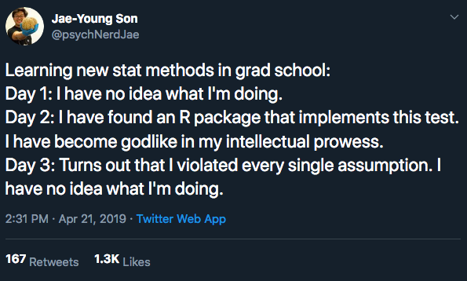

```{r setup, include=FALSE}
options(htmltools.dir.version = FALSE)
r <- getOption("repos")
r["CRAN"] <- "http://cran.cnr.berkeley.edu/"
options(repos = r)
set.seed(12345)
```

<style>

.remark-slide-number {
  position: inherit;
}

.remark-slide-number .progress-bar-container {
  position: absolute;
  bottom: 0;
  height: 6px;
  display: block;
  left: 0;
  right: 0;
}

.remark-slide-number .progress-bar {
  height: 100%;
  background-color: #EB811B;
}

.orange {
  color: #EB811B;
}
</style>

# Congratulations

.font150[
* You now know:
  - Descriptive stats
  - Measurement
  - How experimental and non-experimental research work
  - Probability and Inference
  - Regression
  
* And better: you know how to implement that in R

* Where do we go from here?
]
---

# Next Steps
.font150[
* Unfortunately, this is only the tip of the iceberg...

* Every statistical model has assumptions, and you will learn these in Econometrics.
]
.center[]
---

# Next Steps

.font150[
* But I hope this class taught you to not believe in anything without data

* I also hope that even with data, you remain skeptical.
]

---

# Next Steps
.font150[
* If you want to work with data analysis, a few tips:
  - Learn Python
  - Learn SQL
  - Check out for courses taught by Davi. He is awesome!

* And the most important advice: **be prepared to keep learning**. Techniques evolve fast, and it is hard to keep up if you don't study.

* Please let me know if I can be of any help. You are always welcome during my office hours!
]
---

class: inverse, center, middle

# Final Exam

<html><div style='float:left'></div><hr color='#EB811B' size=1px width=720px></html>  

---

# Final Exam

.font150[
* 20 questions.

* Many different versions.

* Posted on Saturday.

* You will have 10 days to finish the exam.

* The turn-it-in will be on.

]

---
# Final Grade

.font150[
* There were eight problem sets during this class.

* I will drop the smaller grade, and take the average of the remaining grades.

* Per our syllabus: 
  - Problem-Sets = 60%
  - Midterm = 20%
  - Final = 20%

]

---
class: inverse, center, middle

# Questions?

<html><div style='float:left'></div><hr color='#EB811B' size=1px width=720px></html>  
---

class: inverse, center, middle

# Thank you for being amazing students!!

<html><div style='float:left'></div><hr color='#EB811B' size=1px width=720px></html>  

---

class: inverse, center, middle

# See you all in Game Theory!!

<html><div style='float:left'></div><hr color='#EB811B' size=1px width=720px></html>  
