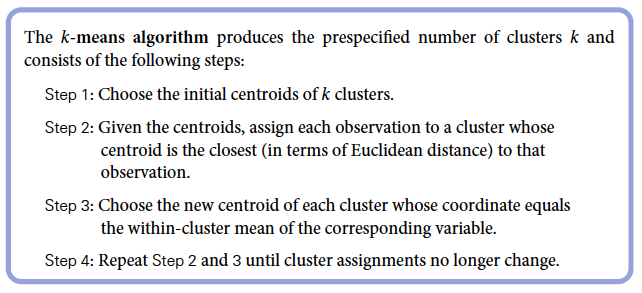

```{r setup, include=FALSE}
options(htmltools.dir.version = FALSE)
r <- getOption("repos")
r["CRAN"] <- "http://cran.cnr.berkeley.edu/"
options(repos = r)
set.seed(12345)
```

<style>

.remark-slide-number {
  position: inherit;
}

.remark-slide-number .progress-bar-container {
  position: absolute;
  bottom: 0;
  height: 6px;
  display: block;
  left: 0;
  right: 0;
}

.remark-slide-number .progress-bar {
  height: 100%;
  background-color: #EB811B;
}

.orange {
  color: #EB811B;
}
</style>

# Today's Agenda

.font150[
* Analyzing experiments with linear regression

* Polarization

* K-Means Cluster

* Data Wrangling with `dplyr`

]
---

class: inverse, center, middle

# Linear Models and RCTs

<html><div style='float:left'></div><hr color='#EB811B' size=1px width=720px></html>  
---

# Linear Models and RCTs

.font150[
* .orange[When the data come from a randomized experiment,] model parameters have a causal interpretation

* Treatment status as the independent variable (0 or 1)
  - 0 indicates control group
  - 1 indicates treatment group
]
--
.font150[
* $Y = \alpha + \beta \times treatment + \epsilon$
]
--
.font150[
* What is the interpretation of $\alpha$ here?

* What is the interpretation of $\beta$ here?
]
---

# Women as Policy Makers

.font120[
* Do women promote different policies than men?

* Observational studies: compare policies adopted by female politicians with those adopted by male politicians

* Randomized natural experiment:
  - one third of village council heads reserved for women
  - assigned at the level of Gram Panchayat (village council) since mid-1990s
  - each GP has multiple villages

* Hypothesis: female politicians represent the interests of female voters

* Female voters complain about drinking water while male voters complain about irrigation
]
---

# Data

| Name         | Description                                                                                                                |
| :----------- | :------------------------------------------------------------------------------------------------------------------------- |
| `GP`         | An identifier for the Gram Panchayat (village council)                                                                     |
| `village`    | identifier for each village                                                                                                |
| `reserved`   | binary variable indicating whether the GP was reserved for women leaders or not                                            |
| `female`     | binary variable indicating whether the GP had a female leader or not                                                       |
| `irrigation` | variable measuring the number of new or repaired irrigation facilities in the village since the reserve policy started     |
| `water`      | variable measuring the number of new or repaired drinking-water facilities in the village since the reserve policy started |

```{r data,fig.align="center",tidy=F,warning=F,message=F,cache=T}
women <- read.csv("https://raw.githubusercontent.com/umbertomig/intro-prob-stat-FGV/master/datasets/women.csv")
names(women)
```
---

# Models

.font110[
* Does the reservation policy increase female politicians?

```{r m1,fig.align="center",tidy=F,warning=F,message=F,cache=T}
tapply(women$female, women$reserved, mean)
```

* Does it change the policy outcomes?
```{r m2,fig.align="center",tidy=F,warning=F,message=F,cache=T}
# drinking-water facilities
tapply(women$water, women$reserved, mean)

# irrigation facilities
tapply(women$irrigation, women$reserved, mean)
```
]
---

# Slope Coefficient = Difference-in-Means

.font120[
```{r women03,fig.align="center",tidy=F,warning=F,message=F,cache=T,highlight.output=2}
tapply(women$water, women$reserved, mean)
```
```{r women04,fig.align="center",tidy=F,warning=F,message=F,cache=T,highlight.output=1}
mean(women$water[women$reserved == 1]) - mean(women$water[women$reserved == 0])
```
```{r women05,fig.align="center",tidy=F,warning=F,message=F,cache=T,highlight.output=7}
lm(water ~ reserved, data = women)
```
]
---


# Resume Experiment Revisited

.font100[

* Our turn: let's analyze the resume dataset!

1. Load the dataset
2. Run a regression on callback and race

```{r soc01,fig.align="center",tidy=F,warning=F,message=F,cache=T}
# Need to get these results: baseline (black) + 
# the effect of having a white-sounding name
0.06448 + 0.03203
```
]
---

# Call Rates and Gender

.font110[
* Now, let's add a gender indicator

1. Run a regression on callback rates and gender
]
---

# Race + Gender

.font120[

* Now, run a regression for both gender and race...

```{r soc02a,fig.align="center",tidy=F,warning=F,message=F,cache=T}
# Call rates for a white male
 0.066534 + 0.032130 - 0.009128
```
* Regression Equation: $Y = 0.066 + 0.032*white - 0.009*male + \epsilon$
]
---

# Interpreting Multiple Predictors

.font150[
* .orange[Ceteris Paribus]: _holding everything else constant_

* Let's interpret the coefficient for _white_ in $Y = 0.066 + 0.032 \times white - 0.009 \times male + \epsilon$

* We say: "_all else equal, having a white-sounding name increases the change of getting a job call in about 3%. Since candidates with black-sounding names a job call rate of about 6%, candidates with white-sounding names are 50% more likely to get a call_"
]

---

# Adjusted R-Squared

.font140[
* When we have more than one independent variable, we need to modify the $R^2$ formula to account for those additional variables

* $R^2$ measures the overall impact of _all_ variables at once, but some might just add noise to the model

* Every predictor added to a model increases $R^2$ and never decreases it

* Adjusted $R^2$ compensates for the addition of variables and only increases _if the new term enhances the model_

* It is usually lower than regular $R^2$ but not much
]

---

class: inverse, center, middle

# Polarization

<html><div style='float:left'></div><hr color='#EB811B' size=1px width=720px></html>  
---

# Polarization

```{r,fig.align="center",tidy=F,warning=F,message=F,cache=T,fig.height=4.5,fig.width=9}
library(tidyverse)
congress <- read.csv("https://raw.githubusercontent.com/umbertomig/intro-prob-stat-FGV/master/datasets/congress.csv")
head(congress)
``` 
---

# Polarization

```{r,fig.align="center",tidy=F,warning=F,message=F,cache=T,fig.height=4.5,fig.width=9}
q <- congress %>%
  filter(congress %in% c(80, 112),
         party %in% c("Democrat", "Republican")) %>%
  ggplot(aes(x = dwnom1, y = dwnom2, colour = party)) +
  geom_point() + facet_wrap(~ congress) + coord_fixed() +
  scale_y_continuous("racial liberalism/conservatism",
                     limits = c(-1.5, 1.5)) +
  scale_x_continuous("economic liberalism/conservatism",
                     limits = c(-1.5, 1.5))
q
``` 

---

# Polarization: coloring the parties

```{r,fig.align="center",tidy=F,warning=F,message=F,cache=T,fig.height=4.5,fig.width=9}
scale_colour_parties <-
  scale_colour_manual(values = c(Democrat = "blue",
                                 Republican = "red",
                                 Other = "green"))
q + scale_colour_parties
```

---

# Polarization: for all legislatures

```{r,fig.align="center",tidy=F,warning=F,message=F,cache=T,fig.height=4.5,fig.width=9}
congress %>%
  ggplot(aes(x = dwnom1, y = dwnom2, colour = party)) +
  geom_point() + facet_wrap(~ congress) + coord_fixed() +
  scale_y_continuous("racial liberalism/conservatism",
                     limits = c(-2, 2)) +
  scale_x_continuous("economic liberalism/conservatism",
                     limits = c(-2, 2))
```

---
# Polarization: median distance over time

```{r,fig.align="center",tidy=F,warning=F,message=F,cache=T,fig.height=4.5,fig.width=9}
congress %>%
  group_by(congress, party) %>%
  summarise(dwnom1 = mean(dwnom1)) %>%
  filter(party %in% c("Democrat", "Republican")) %>%
  ggplot(aes(x = congress, y = dwnom1,
             colour = fct_reorder2(party, congress, dwnom1)))+
  geom_line() + scale_colour_parties +
  labs(y = "DW-NOMINATE score (1st Dimension)", x = "Congress", colour = "Party")
```
---

class: inverse, center, middle

# Your turn: compute the median distance for the second (racial) dimension.

<html><div style='float:left'></div><hr color='#EB811B' size=1px width=720px></html>  

---

# K-Means

.font150[
* Suppose you work on consulting, and have the following problem

* Your boss wants to know which countries are similar in terms of risk

* She wants you to group countries that present similarities, in a way that groups are different from each other, but within groups, as similar as possible.

* You can use K-Means!

* Let's try this for the US Congres...
]
---

# K-Means Algorithm

.center[]
---

# K-Means: Creating the datasets and estimating two clusters

.font100[
```{r,fig.align="center",tidy=F,warning=F,message=F,cache=T,fig.height=4.5,fig.width=9}
dwnom80 <- cbind(congress$dwnom1[congress$congress == 80],
congress$dwnom2[congress$congress == 80])
head(dwnom80, 2)
dwnom112 <- cbind(congress$dwnom1[congress$congress == 112],
congress$dwnom2[congress$congress == 112])
head(dwnom80, 2)
## k-means with 2 clusters
k80two.out <- kmeans(dwnom80, centers = 2, nstart = 5)
k112two.out <- kmeans(dwnom112, centers = 2, nstart = 5)
``` 
]

---

# K-Means: final centroids

.font100[
```{r,fig.align="center",tidy=F,warning=F,message=F,cache=T,fig.height=4.5,fig.width=9}
## final centroids
k80two.out$centers
k112two.out$centers
``` 
]


---

# Interation with parties
.font100[
```{r,fig.align="center",tidy=F,warning=F,message=F,cache=T,fig.height=4.5,fig.width=9}
## number of observations for each cluster by party
table(party = congress$party[congress$congress == 80],
cluster = k80two.out$cluster)
table(party = congress$party[congress$congress == 112],
cluster = k112two.out$cluster)
``` 
]

---

# Now K-Means with four clusters

.font100[
```{r,fig.align="center",tidy=F,warning=F,message=F,cache=T,fig.height=4.5,fig.width=9}
## k-means with 4 clusters
k80four.out <- kmeans(dwnom80, centers = 4, nstart = 5)
k112four.out <- kmeans(dwnom112, centers = 4, nstart = 5)
## plotting the results using the labels and limits defined earlier
plot(dwnom80, col = k80four.out$cluster + 1, main = "80th Congress")
## plotting the centroids
points(k80four.out$centers, pch = 8, cex = 2)
## 112th Congress
plot(dwnom112, col = k112four.out$cluster + 1, main = "112th Congress")
points(k112four.out$centers, pch = 8, cex = 2)
``` 
]

---

class: inverse, center, middle

# Your turn: data wrangling!

<html><div style='float:left'></div><hr color='#EB811B' size=1px width=720px></html>  
---

class: inverse, center, middle

# See you next week!

<html><div style='float:left'></div><hr color='#EB811B' size=1px width=720px></html>  